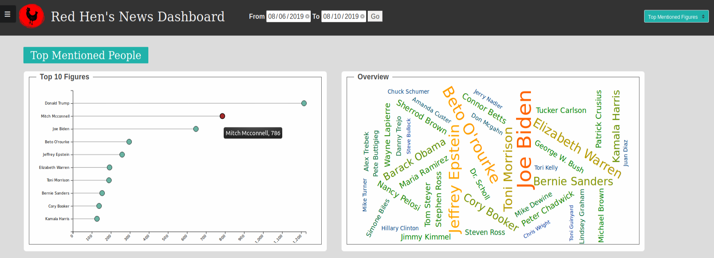
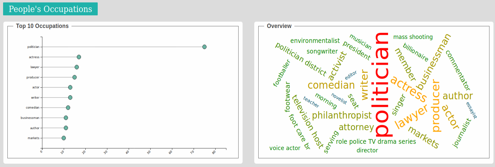
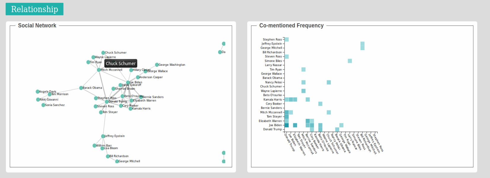
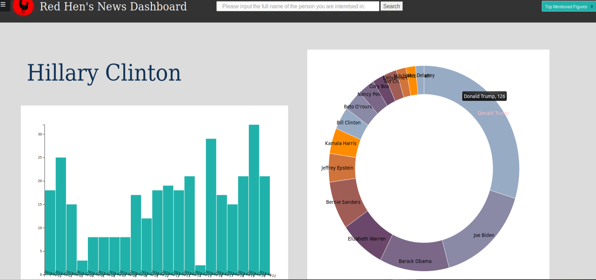

# GSoC2019: Red Hen's News Dashboard

_This is my [Google Summer of Code 2019](https://summerofcode.withgoogle.com/projects/#5623384702976000) project with the [Distributed Little Red Hen Lab](http://www.redhenlab.org/)._

This project aims at creating a modularized and navigable visualization dashboard based on Red Hen Lab's multimodal data.

Project Mentors: Francis Steen, Qu Huamin, Robert Ochshorn


## 1. Back-end Processing Flow

> Python packages used: `wikipedia`, `spacy`, `nltk`  

#### 1.1 Data Source

In this project, we use the `.seg` files of daily news as raw input that are available on Cartago under the directory `/tv`. The directory is structured as`{year}/{year}-{month}/{year}-{month}-{day}`. 


#### 1.2. Processing Pipeline

This pipeline will wash and process the raw SEG files and output JSON formatted data for visualization, storing them in MongoDB. The front-end interface will fetch data for visualization from MongoDB.

**Scripts**

`GetNes.py` : Get named entities from SEG files, such as persons, emotions, etc.

`GetOccupation.py`: Utilize `wikipedia` API to get the occupations of a given person. Since `wikipedia` only returns the text description, this script also do NLP with `spacy` and `nltk` to get the occupations.

`main.py`: integrate all scripts, connect to MongoDB, store the generated data to it.

**Hot to run it**

At the `data-processing` directory, run `python main.py {year} {month} {day} {root-of-raw-data}`, which will automatically update the database to the specified date (start date: 2019-01-01, end date: given by user, the start day could be modified in `main.py`). 

For example, if the raw data folder is `/tv`, to update the database to 2019-08-21, run `python main.py 2019 08 21 /tv`.


#### 1.3 The Database

**Configuration Info**

We use MongoDB, a NoSQL database to store our data. We use mongo's default port `27017`. 

Check the default DB path: `grep dbpath /etc/mongodb.conf`

Under my ubuntu system, the path should be `dbpath=/var/lib/mongodb`, while it may vary based on different system.

**Schema**

The database is named `news` , within which there are three collections: `byDate`, `byPerson`, and `dateList`.

**`byDate`:** stores data for creating visualization plots. A document includes 6 fields:

- `persons: [{ "key": str, "count": int }, ...]`
- `links: [{ "source": str, "target": str, "value": int }, ...]`

- `nodes: [{ "id": str }, ...]` # used in network graph

- `axis: [str, ...]`

- `pairs: [{ "source": str, "target": str, "value": int }, ...]`

- `occupations: [{ "key": str, "count": int }, ...]`

**`byPerson`**: enable query over persons. A document includes 3 fields:

- `name: str`
- `count: [ {  "date": datetime, "num": int }, ... ]`
- `network: [ {  "name": str, "num": int }, ... ]`

**`dateList`**: For the convenience for the updating of the database, we keep a record of those already stored days. The python script will automatically skip those dates whose data have been stored in the database.


#### 1.4 Server Side

Different from Red Hen's previous visualization projects, the dashboard doesn't rely on static JSON files, but interact with the database instead. This increases the flexibility to create new visualization modules that require different format of data.

To connect the front end interface to the database, we employ `flask`, a web framework written in python to be the bridge. We use `pymongo` and `Flask-PyMongo` together with `flask` for database CRUD and aggregation operations. I considered `Node.js` and spent some time trying to build it, but find it unwieldy under the scope of this project. First, since the project involves a lot of data pre-processing using python, it will be great if the backend is consistent with python, rather than mix python and javascript (for Node.js). Second, flask is much easier to deploy and manage than Node.js (see the file structure below)

```
# Structure of dashboard
├── aggregate.py
├── app.py
├── Pipfile
├── Pipfile.lock
├── static
│   ├── external
│   │   ├── d3.layout.cloud.js
│   │   └── require.js
│   ├── logo.png
│   ├── page.js
│   ├── plot.js
│   └── style.css
└── templates
    ├── index.html
    └── search.html
```


## 2. Front-end Interface

 The front-end interface mainly consists of 4 parts: top-mentioned names, top occupations, relationship, news profile.

#### 2.1 Top Mentioned Names and Occupations





The first two sections summarize the top mentioned people and their occupations in TV news within a given time range (The figure above shows the summary from 08/06/2019 to 08/10/2019. This gives an overview of public features in TV news.

#### 2.2 Relationship Network

 

This section visualizes the relationship among people mentioned in TV news. The social network shows the entire network within a user specified time range. While the co-mentioned frequency shows the top 22 people with the most connections.

#### 2.3 News Profile of a person



This section enables search of your interested person. It summarizes the person's mention frequency in the last 30 days and top 15 persons he/she has most connections with. Again, connection is evaluated by the co-mention frequency in the same news.

#### 2.4 Modularized Plotting Code

The code for creating plots is in `plot.js`, where each function takes JSON formatted data and draw the plot in a given HTML section. The code is highly reusable from two aspects:

1. The plotting function is highly capsulated. Programmer only needs to pass in the data and his/her desired HTML section.

2. The plotting only utilizes D3.js. While other libraries like DC.js may provide simpler implementation of charts, there is less flexibility in them. Latter programmers can customize the plot easier.

   

## 3. Run the project

The project relies on several dependencies. Therefore, it is recommended to run it inside a singularity container with all dependencies installed.

To get the singularity container, we may directly use the already built image file (2.0 GB) or build it from the singularity recipe file named `Singularity`. 

**Build the singularity container from recipe file**

```bash
# build image from recipe at the project directory with root permission
sudo singularity build --bind /dashboard,/data-processing:/mnt --writable dashboard.img Singularity
```

**What to do inside the container **

```bash
singualrity shell dashboard.img

# First, copy /dashboard, /data-processing to a desired project folder
mkdir ~/Project
mv /mnt/dashboard, /mnt/data-processing ~/Project
cd ~/Project

# Build the database on the local machine first! (Assume raw SEG files are available on the machine at /news directory)
cd data-processing
python3 main.py 2019 8 25 /news # Take quite some time to update because of NLP

# After the database is built successfully
cd ../dashboard
pipenv install
pipenv install flask
flask run # Browse localhost:5000 after that
```


## 4. Summary 

This is the first time for me to take part in Google Summer of Code. I sincerely appreciate Red Hen Lab for granting me with such a precious opportunity. I would like to express my greatest thanks to Professor Steen, Dr. Peter Broadwell and Dr. Weixin Li for their warm assistance.

As a UG student, I learnt quite a lot from the project, and I developed more interest in the area of visualization, but there are still some pities. For example, I found it hard to create a visualization based on events: because the lack of NLP knowledge, I could not get accurate event descriptions from the raw SEG files. A summer's time is not enough for me to create a fancier project from scratch due to the lack of knowledge and experience, while I cordially would like to continue my journey with Red Hen's project after the summer, under the guidance of HKUST Vis Lab. I would be a junior student in the new semester to come. I would aim at creating visualization project at a publication standard.