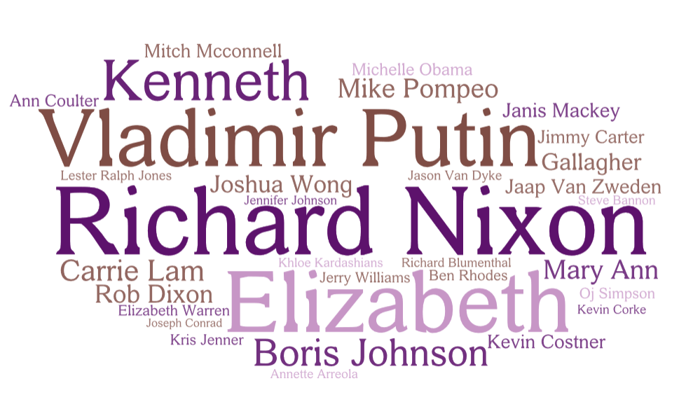

In this post, I will show my attempt to extract top-mentioned persons from the tv script and draw a word cloud accordingly.

### 1. `NLTK` or `spaCy` ?

|       |                             PROS                             |                CONS                |
| ----- | :----------------------------------------------------------: | :--------------------------------: |
| NLTK  | Academia & Many third party extensions & plenty of approaches to each NLP task | quite slow & hard to learn and use |
| spaCy |         fast & easy to use & neural network provided         | less flexibility & fewer language  |

Considering the requirement of our project, at current stage, we choose `spaCy` for the ease of development. Moreover, there is still lots of space for customization with `spaCy`. I will keep learning NLP related knowledge to extract more accurate and insightful information from the textual data.

### 2. Use `spaCy` to conduct NER

`Spacy` is designed to build real products, and relatively easy to learn. There are lots of useful resources on https://spacy.io/usage.  

To configure `spaCy` module, it is the easiest to use `pip`. While `pip` is not installed on Cartago, we may compile from source and install it in a singularity container.

Aside from installing the package, one must install a specified model to conduct NLP tasks. The common approach is to resort to `python -m spacy download <model>`

### 3. Extract the text data from TV scripts

`scaCy` performs its NLP pipeline on clean textual data. I took the textual data from `*US*.txt` files. Note that there are quite a lot of strange symbols in the script, for example, '♪'. Therefore, use `gb18030` when reading files, or there will be `UnicodeDecodeError: 'gbk' codec can't decode byte...` errors occurring. 

`open(file, encoding='gb18030', errors='ignore')` can tackle most of the cases. Dr. Weixin also used `codec` module.

### 4. Generate Word Cloud

Much NLP work still needs to be done as for extracting meaningful topics. I start with the easy part, extract top mentioned persons from the script.

*Word Cloud for People of 2019-06-17*

This is my attempt to visualize top mentioned people on 2019-06-17. The size of a name is based on its counts in the day's news scripts. 

Word cloud is a routine visualization approach for named entities, while there are still many tricks to improve its readability and make it carrying more information. In the next several days, I plan to build a ***"Smart"* word cloud generator** tailored for Red Hen's TV news based on the following observations.

- In this word cloud, I removed the word "Donald", while it is actually the 2nd most mentioned people with counts of 92. In US context, it is predictable that "Donald" will stay on the list of top mentioned people for a long time, which leads to its appearance on the word cloud carrying little information. **It is necessary to maintain a list of  always-mentioned people and reduce their weight in the word cloud.** This task is data driven.

- In a TV programme, people are usually called by name, and in few cases will people be mentioned by their full names. This leads to the problem of information omission. The actual top mentioned name I extracted is *Steve*, while no body knows which Steve the person is. Similar problem exists for *Jeff*. Even though it is reasonable to guess the person to be Jeff Bezos, it is impossible to manually do annotations. **It is necessary to find out a scheme to complement the full name of a person according to the context.** This should be a machine learning task.

- I notices the two names *"Carrie Lam"* and *"Joshua Wong"*, which are highly correlated since they are both main roles in Hong Kong Extradition Bill. **Is it possible to put highly correlated names close to each other?** This task will rely on a person-event model.

  I'm quite interested in how US news report the Hong Kong Extradition Bill event. Probably I can start from data mining and visualization from this event and promote the pipeline to other events. : )

- Remove the name of hosts from the list. Maintain a stop word list.

- Animation and user interaction.

  

### 5. What Next?

The biggest problem at present is the data mining part.

1. Extract the hidden relationship between people and visualize it

2. Extract the hidden relationship between people and events and visualize it

3. Adopt an appropriate topic model, extract topics, and plot its trend.

   https://towardsdatascience.com/topic-modeling-and-latent-dirichlet-allocation-in-python-9bf156893c24
